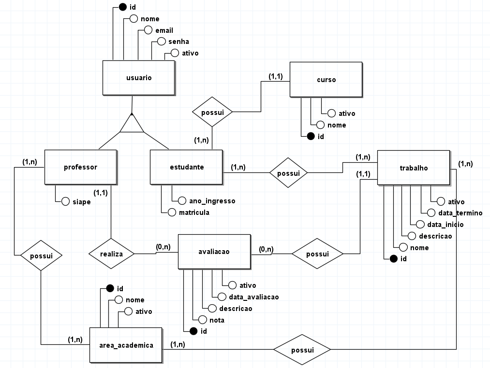
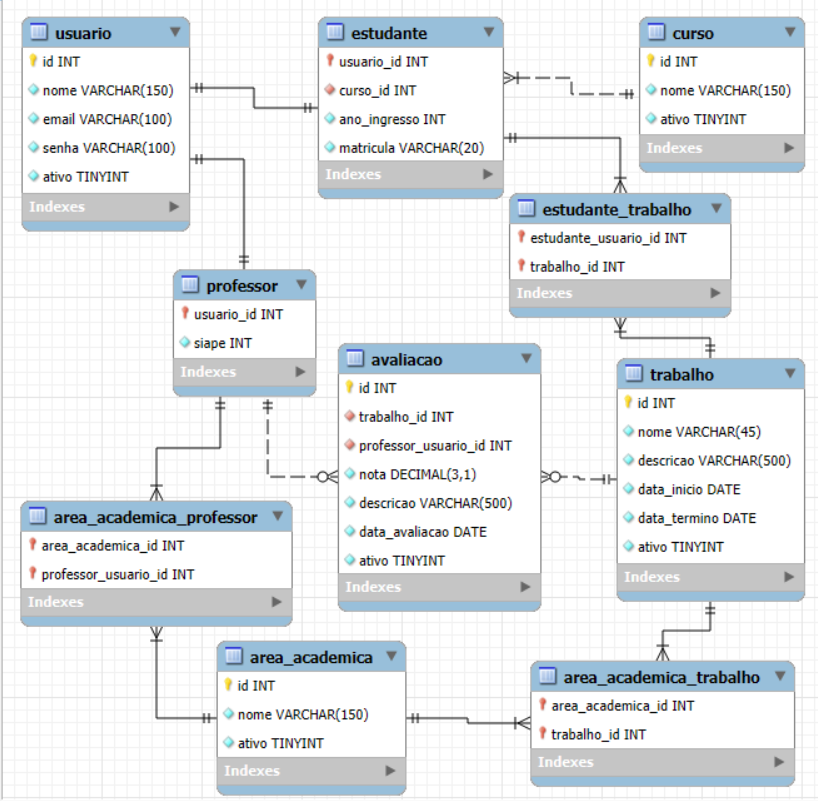

# Sistema Acadêmico para Avaliação de Trabalhos
## Descrição do Projeto
Este projeto foi desenvolvido como parte do Trabalho Final da disciplina **Banco de Dados I** do curso de **Tecnólogo em Análise e Desenvolvimento de Sistemas (TADS)** no **Instituto Federal do Paraná (IFPR) - Campus Paranaguá**.

O objetivo do projeto é criar um protótipo de sistema para gerenciamento de avaliações de trabalhos apresentados em eventos acadêmicos do campus, como a SEMEPI. Essa solução busca substituir os processos manuais atualmente utilizados, que dependem de planilhas e formulários online, oferecendo uma abordagem mais eficiente e integrada.

---
---
## Autores do projeto
- `João Vitor Santos Dias da Silva`
- `Cristian Oliveira Mitugui`
- `Nicholas Martins Kotzias`
---
---

## Funcionalidades
Até o momento, o protótipo do sistema implementa as seguintes funcionalidades (a fim de apenas cumprir os requisitos do trabalho) :

### Usuários:
- Cadastrar usuários.
- Listar usuários cadastrados.
- Atualizar informações de usuários.
- Excluir usuários.
### Professores:
- Cadastrar professores.
- Listar professores cadastrados.
- Atualizar informações de professores.
### Estudantes:
- Cadastrar estudantes.
- Listar estudantes cadastrados.

---

## Estrutura do Projeto

### Modelo Entidade-Relacionamento (MER)
O MER define as relações entre as tabelas do sistema, representando entidades como **usuário**, **professor**, **estudante**, **curso**, **trabalho**, **avaliação** e **área acadêmica**.



### Diagrama Relacional (DR)
O DR detalha como as entidades do MER foram convertidas para tabelas e suas relações no banco de dados.


---

## Scripts SQL

### Criação do Banco de Dados

```sql
CREATE DATABASE IF NOT EXISTS sistema_academico;
USE sistema_academico;

-- Tabela usuario
CREATE TABLE usuario (
    id INT NOT NULL AUTO_INCREMENT,
    nome VARCHAR(150) NOT NULL,
    email VARCHAR(100) NOT NULL UNIQUE,
    senha VARCHAR(100) NOT NULL,
    ativo TINYINT DEFAULT 1,

    PRIMARY KEY(id)
) engine = InnoDB;

-- Tabela professor
CREATE TABLE professor (
    usuario_id INT NOT NULL,
    siape INT NOT NULL UNIQUE,

    PRIMARY KEY(usuario_id),

    CONSTRAINT fk_professor_usuario_id
        FOREIGN KEY (usuario_id) REFERENCES usuario(id)
        ON DELETE NO ACTION ON UPDATE NO ACTION
) engine = InnoDB;

-- Tabela curso
CREATE TABLE curso (
    id INT NOT NULL AUTO_INCREMENT,
    nome VARCHAR(150) NOT NULL UNIQUE,
    ativo TINYINT DEFAULT 1,

    PRIMARY KEY(id)
) engine = InnoDB;

-- Tabela estudante
CREATE TABLE estudante (
    usuario_id INT NOT NULL,
    curso_id INT,
    ano_ingresso INT NOT NULL,
    matricula VARCHAR(20) UNIQUE NOT NULL,

    PRIMARY KEY(usuario_id),

    CONSTRAINT fk_estudante_usuario_id
        FOREIGN KEY (usuario_id) REFERENCES usuario(id)
        ON DELETE NO ACTION ON UPDATE NO ACTION,
    CONSTRAINT fk_estudante_curso_id
        FOREIGN KEY (curso_id) REFERENCES curso(id)
        ON DELETE NO ACTION ON UPDATE NO ACTION
) engine = InnoDB;

-- Tabela trabalho
CREATE TABLE trabalho (
    id INT NOT NULL AUTO_INCREMENT,
    nome VARCHAR(45) NOT NULL,
    descricao VARCHAR(500),
    data_inicio DATE,
    data_termino DATE,
    ativo TINYINT DEFAULT 1,

    PRIMARY KEY(id)
) engine = InnoDB;

-- Tabela estudante_trabalho
CREATE TABLE estudante_trabalho (
    estudante_usuario_id INT NOT NULL,
    trabalho_id INT NOT NULL,

    PRIMARY KEY(estudante_usuario_id, trabalho_id),

    CONSTRAINT fk_estudante_trabalho_usuario_id
        FOREIGN KEY (estudante_usuario_id) REFERENCES estudante(usuario_id)
        ON DELETE NO ACTION ON UPDATE NO ACTION,
    CONSTRAINT fk_estudante_trabalho_id
        FOREIGN KEY (trabalho_id) REFERENCES trabalho(id)
        ON DELETE NO ACTION ON UPDATE NO ACTION
) engine = InnoDB;

-- Tabela avaliacao
CREATE TABLE avaliacao (
    id INT NOT NULL AUTO_INCREMENT,
    trabalho_id INT NOT NULL,
    professor_usuario_id INT NOT NULL,
    nota DECIMAL(3, 1),
    descricao VARCHAR(500),
    data_avaliacao DATE,
    ativo TINYINT DEFAULT 1,

    PRIMARY KEY(id),

    CONSTRAINT fk_avaliacao_trabalho_id
        FOREIGN KEY (trabalho_id) REFERENCES trabalho(id)
        ON DELETE NO ACTION ON UPDATE NO ACTION,
    CONSTRAINT fk_avaliacao_professor_usuario_id
        FOREIGN KEY (professor_usuario_id) REFERENCES professor(usuario_id)
        ON DELETE NO ACTION ON UPDATE NO ACTION
) engine = InnoDB;

-- Tabela area_academica
CREATE TABLE area_academica (
    id INT NOT NULL AUTO_INCREMENT,
    nome VARCHAR(150) NOT NULL UNIQUE,
    ativo TINYINT DEFAULT 1,

    PRIMARY KEY(id)
) engine = InnoDB;

-- Tabela area_academica_professor
CREATE TABLE area_academica_professor (
    area_academica_id INT NOT NULL,
    professor_usuario_id INT NOT NULL,

    PRIMARY KEY(area_academica_id, professor_usuario_id),

    CONSTRAINT fk_area_professor_area_id
        FOREIGN KEY (area_academica_id) REFERENCES area_academica(id)
        ON DELETE NO ACTION ON UPDATE NO ACTION,
    CONSTRAINT fk_area_professor_usuario_id
        FOREIGN KEY (professor_usuario_id) REFERENCES professor(usuario_id)
        ON DELETE NO ACTION ON UPDATE NO ACTION
) engine = InnoDB;

-- Tabela area_academica_trabalho
CREATE TABLE area_academica_trabalho (
    area_academica_id INT NOT NULL,
    trabalho_id INT NOT NULL,

    PRIMARY KEY(area_academica_id, trabalho_id),

    CONSTRAINT fk_area_trabalho_area_id
        FOREIGN KEY (area_academica_id) REFERENCES area_academica(id)
        ON DELETE NO ACTION ON UPDATE NO ACTION,
    CONSTRAINT fk_area_trabalho_id
        FOREIGN KEY (trabalho_id) REFERENCES trabalho(id)
        ON DELETE NO ACTION ON UPDATE NO ACTION
) engine = InnoDB;
```

### Povoamento do Banco de Dados
```sql
-- Inserindo dados na tabela usuario
INSERT INTO usuario (nome, email, senha) VALUES
('Cristian Oliveira Mitugui', 'cristian.oliveira@email.com', 'senha123'),
('João Vitor Santos Dias da Silva', 'joao.vitor@email.com', 'senha123'),
('Nicholas Martins Kotzias', 'nicholas.martins@email.com', 'senha123'),
('João', 'joao@email.com', 'senha123'),
('Wagner Weinert', 'wagner.weinert@email.com', 'senha123'),
('Allan Kreeling', 'alan.kreeling@email.com', 'senha123');

-- Inserindo dados na tabela professor
INSERT INTO professor (usuario_id, siape) VALUES
(5, 11111),
(6, 22222);

-- Inserindo dados na tabela curso
INSERT INTO curso (nome) VALUES
('Técnologo em Análise e Desenvolvimento de Sistemas'),
('Técnologo em Gestão Ambiental');

-- Inserindo dados na tabela estudante
INSERT INTO estudante (usuario_id, curso_id, ano_ingresso, matricula) VALUES
(1, 1, 2024, 'ES2022001'),
(2, 1, 2024, 'ES2022002'),
(3, 1, 2024, 'ES2022003'),
(4, 2, 2024, 'ES2022004');

-- Inserindo dados na tabela trabalho
INSERT INTO trabalho (nome, descricao, data_inicio, data_termino) VALUES
('Komisan', 'Uma Aplicação Web para Artistas Digitais', '2024-06-01', '2024-06-30'),
('Drive Guard', 'Uma Aplicação Mobile para Manutenção Veícular', '2024-06-15', '2024-07-15'),
('Compartilhe', 'Incentivo a Atividade de Circulação de Roupas Usadas', '2024-06-15', '2024-07-15');

-- Inserindo dados na tabela estudante_trabalho
INSERT INTO estudante_trabalho (estudante_usuario_id, trabalho_id) VALUES
(1, 1),
(2, 2),
(4, 3);

-- Inserindo dados na tabela avaliacao
INSERT INTO avaliacao (trabalho_id, professor_usuario_id, nota, descricao, data_avaliacao) VALUES
(1, 5, 9.0, 'Bom trabalho', '2024-06-20'),
(2, 5, 8.5, 'Ótima ideia', '2024-07-05'),
(3, 6, 8.7, 'Ótima ideia', '2024-07-05');

-- Inserindo dados na tabela area_academica
INSERT INTO area_academica (nome) VALUES
('Aplicações Mobile'),
('Aplicações Web'),
('Banco de Dados'),
('Gestão Ambiental');

-- Inserindo dados na tabela area_academica_professor
INSERT INTO area_academica_professor (area_academica_id, professor_usuario_id) VALUES
(1, 5),
(2, 5),
(3, 5),
(4, 6);

-- Inserindo dados na tabela area_academica_trabalho
INSERT INTO area_academica_trabalho (area_academica_id, trabalho_id) VALUES
(1, 2),
(2, 1),
(4, 3);
```

---

## Implementação em Java
A aplicação Java foi desenvolvida para:
1. Realizar conexão com o banco de dados MySQL.
2. Implementar as operações de **inserção**, **consulta**, **alteração** e **exclusão** de registros.

### Tecnologias Utilizadas
- **Java**
- **JDBC** para conexão com o banco de dados.
- **MySQL** como SGBD.
- **Dotenv** para gerenciamento das variáveis de ambiente do projeto

### Estrutura do Código Java
O código fonte está estruturado em pacotes:
- `config`: Contém classes para configuração do sistema, como a FabricaDeConexoes, responsável pela criação e gerenciamento da conexão com o banco de dados.
- `exceptions`: Agrupa classes para tratamento de exceções específicas do sistema.
- `interfaces`: Inclui interfaces que definem os contratos para operações no banco de dados.
- `modulos`: Os módulos são pastas que organizam o sistema de acordo com as funcionalidades. Cada módulo é responsável por um conjunto de operações e objetos relacionados.
- `App.java`: Classe principal para execução do programa.
- `resources`: Diretório reservado para recursos adicionais utilizados pelo sistema. No momento, contém a pasta `db/migration`, que armazena os arquivos de migração do banco de dados. Esses arquivos são responsáveis por gerenciar as alterações no esquema do banco ao longo do tempo.

O caminho lógico para qualquer operação é de App.java -> Service -> DAO
- `App.java`: nela está disposto o menu

---
---

# **Como Executar o Projeto**

### Requisitos
- **Java 17** ou superior.
- **MySQL Server**.

### Passos para Execução
1. Clone o repositório:
   ```
   git clone https://github.com/mitugui/proto-avaliacao-de-trabalhos.git
   ```
2. Importe o projeto na sua IDE.
3. Configure o arquivo `.env` com as credenciais do banco de dados:
   ```env
    DB_TYPE
    DB_HOST
    DB_PORT
    DB_NAME
    DB_USER
    DB_PASSWORD
   ```
4. Execute os scripts SQL de criação e povoamento do banco.
5. Execute a classe `Main` para iniciar a aplicação.

---
---
###### Importante: Este ***README.md*** reflete a estrutura e o estado atual do projeto. Caso haja modificações ou atualizações futuras, o conteúdo deste arquivo pode não corresponder mais à versão mais recente do projeto.

---
---
###### Importante: Este projeto foi inicialmente desenvolvido como parte do trabalho final da disciplina Banco de Dados I. Portanto, é esperado que a qualidade de desenvolvimento não seja comparada a projetos de longo prazo ou com objetivos profissionais.

 ---